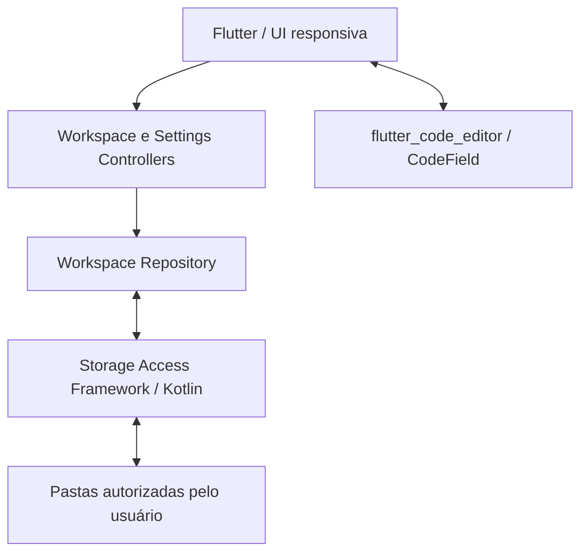

# Arquitetura do MV Code 3.1

## Visão geral

O editor de texto é agora um widget Flutter nativo (`CodeField` + `CodeController`).
Não há Monaco, iframe, HTML, JavaScript nem WebView no caminho de edição.

A WebView permanece somente no módulo opcional de **pré-visualização HTML**, onde ela é
apropriada para renderizar a página criada pelo usuário. Ela não participa da abertura,
edição nem gravação dos arquivos.

## Módulos

| Módulo | Responsabilidade |
|---|---|
| `features/editor` | `flutter_code_editor`, cursor, diagnósticos locais e teclado extra |
| `features/workspace` | árvore, abas, comandos e estado dos documentos |
| `features/search` | busca recursiva e navegação para resultados |
| `features/preview` | pré-visualização local de HTML |
| `features/settings` | tema, fonte, tabulação, wrap, linhas e autosave |
| `core` | tema e captura centralizada de falhas |
| `MainActivity.kt` | SAF, permissões persistentes e I/O Android |

## Fluxo de edição

1. O SAF lê o arquivo escolhido.
2. `WorkspaceController` mantém o conteúdo da aba em `OpenDocument.initialContent`.
3. `FlutterCodeEditorView` cria um `CodeController` para a aba ativa.
4. Cada alteração é copiada imediatamente para o estado da aba, sem ponte JavaScript.
5. Salvar usa o conteúdo mantido no estado Flutter e grava via SAF.
6. Trocar de aba recria o `CodeController` com o conteúdo preservado daquela aba.

Isso elimina o estado "Preparando editor..." da implementação anterior e também evita
depender do ciclo de vida de uma WebView durante a troca de widgets/abas.

## Build Android

O wrapper Gradle foi alinhado novamente à versão funcional fornecida (`8.14`).
Caches gerados (`build`, `.dart_tool`, `android/.gradle` e `android/.kotlin`) não fazem
parte do pacote corrigido e não devem ser reaproveitados entre máquinas.
